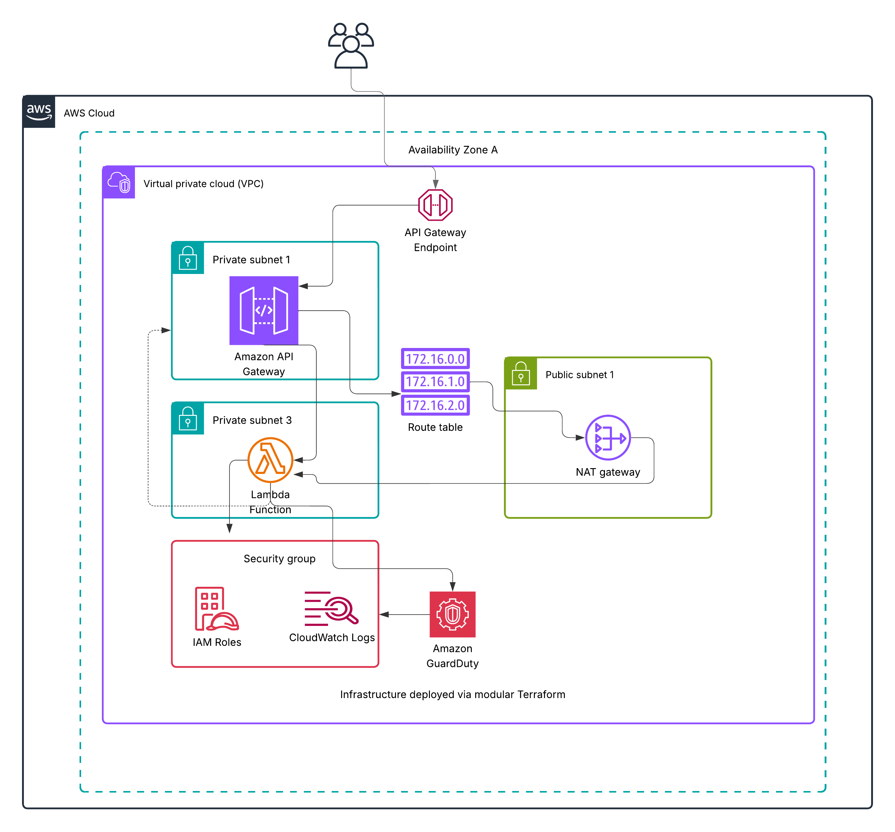
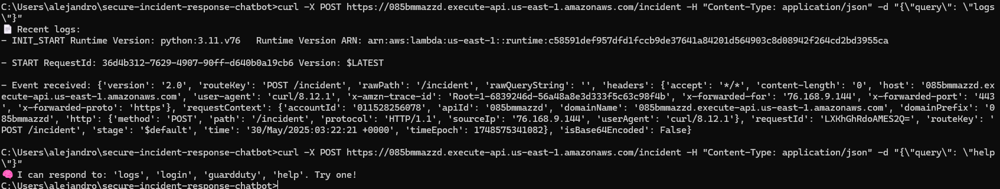
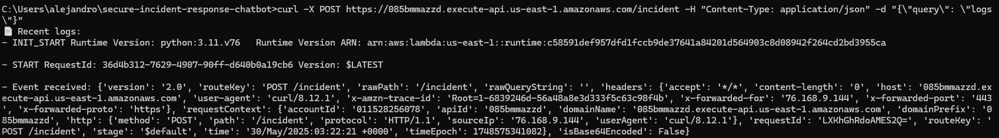
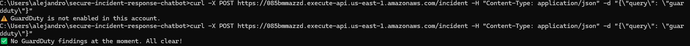

# 🔐 Secure Incident Response Chatbot (AWS + Terraform)

  
  
  

This project deploys a secure, serverless **incident response chatbot** using AWS infrastructure managed via **modular Terraform**. The chatbot responds to commands like `logs`, `guardduty`, and `help` by querying CloudWatch and GuardDuty from a Lambda function running in a **private subnet**.

---

## 📸 Architecture

---

## 🚀 Features

- Serverless chatbot with AWS Lambda
- Secure HTTPS API using API Gateway (no key required)
- Lambda runs inside a private subnet (no public IP)
- NAT Gateway routes outbound requests
- Retrieves CloudWatch logs (last 10 min)
- GuardDuty integration (returns threat status)
- Easy to extend (`login`, `status`, etc.)
- Infrastructure-as-Code using modular Terraform

---

## 🧠 How It Works

1. A user sends a POST request to API Gateway.
2. API Gateway invokes the Lambda function in a private subnet.
3. Lambda uses the NAT Gateway to securely reach CloudWatch and GuardDuty.
4. Lambda responds with real-time system and security insights.

---

## 📂 Project Structure

secure-incident-response-chatbot/
├── assets/ # Architecture diagram + screenshots
├── modules/
│ ├── api-gateway/
│ ├── cloudwatch/
│ ├── iam/
│ ├── lambda/
│ ├── vpc/
├── main.tf
├── variables.tf
├── outputs.tf
├── provider.tf
├── backend.tf
├── LICENSE
└── README.md

---

## 🧪 How to Test

**Command-line test (Windows CMD or PowerShell):**
curl -X POST https://<your-api-url>/incident -H "Content-Type: application/json" -d "{"query": "logs"}"
curl -X POST https://<your-api-url>/incident -H "Content-Type: application/json" -d "{"query": "guardduty"}"
curl -X POST https://<your-api-url>/incident -H "Content-Type: application/json" -d "{"query": "help"}"

Example output:
📄 Recent logs:

INIT_START Runtime Version: python:3.11.v76

START RequestId: ...

Event received: { ... }

---

## 🧱 Real-World Roadblocks (Resolved 💪)

- **Lambda timeouts** — Fixed by adjusting timeout + narrowing CloudWatch query window  
- **IAM permission errors** — Resolved by refining trust and execution policies  
- **GuardDuty not enabled** — Activated manually in `us-east-1`  
- **Module input issues** — Declared `subnet_ids` and `vpc_id` in `lambda` module  
- **Security Group conflict** — Fixed by destroying and recreating stale SG  

These challenges helped reinforce advanced Terraform troubleshooting, VPC networking, and AWS service integration.

---

## 🧾 License

This project is licensed under the [MIT License](./LICENSE)

---

## 👨‍💻 Author

**Roberto A Cardenas**  
Cloud Engineer • IaC Builder • AWS Infrastructure Developer

---

## 📸 Demo Screenshots

| Feature            | Screenshot |
|--------------------|------------|
| Curl Commands      |  |
| CloudWatch Logs    |       |
| GuardDuty Status   |                    |

---

**Built for security. Powered by AWS. Managed with Terraform.**

